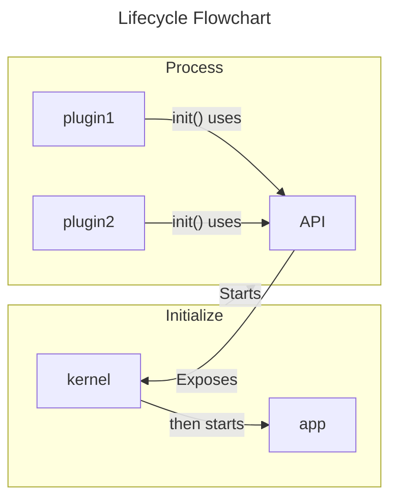
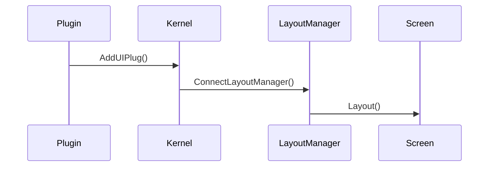
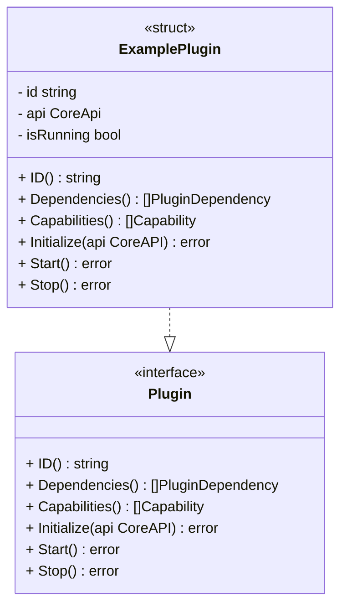

# API Design

This file will be the brainstorming of how our core API will work
with our plug-ins. I think I've discovered a good flow on how things can
work out. My thinking so far has followed a bottom-top approach, looking at
what our Plugin interface needs and determining our Core API from that. Since
most of the work is in our Plugins, it would make sense for things to start
there

- Index
  - [Core API](#core-api)
    - [API Considerations](#api-considerations)
    - [Lifecycle](#lifecycle)
    - [UI](#ui)
    - [Event System](#event-system)
  - [Plug-in Interface](#plug-in-interface)
  - [Future Enhancement](#future-enhancements)

## TL;DR

The listed requirement so far are

| Core API | Reason |
| --- | ------ |
| UI  | Provide a way for plugins to declare their UI using Gio |
| Event System | Provide way for plugins to emit/subscribe to events |
| Resource Management | To manage plugin lifecycles and resources |

| Plugin Interface | Reason |
| -----------------| ------ |
| ID | Identifier |
| Dependencies | To determine load order with Core and avoids event related issues |
| Capabilities | Declare what features/areas the plugin needs access to |
| Initialize | To receive Core API reference and perform setup: "Here's what you need to work" |
| Start | Plugins might need their own start instructions: "Now begin your work" |
| Stop | Plugins would also need their own way to stop |

## Core API

This is probably the toughest thing moving forward right now. There are a lot of things
we have to consider when making our API:

- Where should our responsibilities lie?
- What defines what?
- Can should plugins do? What they can't do?
- How much responsibility does a Microkernel have?

These questions don't have a simple answer within microkernel software systems.
It seems like each microkernel system has their own unique set of problems and
there is no "one size fits all" solution. We cannot treat this like a simple problem
so this needs much more thinking than I thought.

### API Considerations

So far the main considerations based off of our plugin interface is:

- UI
  - Plugins should be able to declare their ui and be able to add it into the main application window. Our GUI is Gio
- Event System
  - Plugins should be able to emit events and subscribe to other events. The Core will handle how this is done
- Resource Management
  - Plugins should also be able to do things like save to a database, delcare preferences and save them, etc.

### Lifecycle



### UI

We can leverage Gio's concepts to our advantage and copy how we've handled the event system:

```go
// api def
api.AddUIPlug(widget layout.Widget)

// kernel 
map[string][]UIPlug // string -> Plugin Id

// UIPlug
type UIPlug struct {
  UI          layout.Widget
  Destination string
}
```

Because layout.Widget is a function, we can just store the functions within the kernel associated with a Plugin Id, and be able to determine with the UIPlug:

- What to run (returning the widget)
  - The kernel will just run that function that is stored
- Where is should be (sidebar, main area, toolbar, etc.)
  - The Kernel can just determine where this needs to go based off of destination

UI flow now works as follows:



### Event System

Events will be incredibly important since plugins will depend on other events for invoking some sort of internal method in the plugins. A concept could look like

```go
api.Emit("Event Name", someMethodCausingEmition)
api.Subscribe("Event Name", someMethodBeingInvoked)
```

We can use this sort of setup:
```go
// string -> Event Name
// EventHandler -> function to be invoked 
map[string][]EventHandler
```

Our Kernel can simply search for the event that was emitted within our hashmap, and then invoke all events that are within that key:

- ex: { "someEvent": [plugin.somefunction, plugin2.anotherfunction] }

### Resource Management

## Plug-in Interface

Right now we are considering:



This shows how our Plugin interface is defined and how it can be implemented. The main methods are:

- ID() string
- Dependencies() []PluginDependency
- Capabilities() []Capability
- Initialize(api CoreAPI) error
- Start() error
- Stop() error

### ID

Our plugin would need an identifier so of course we will have an ID method to let our core access its id

### Dependencies

If plug-ins can be able to list **dependencies**, the core will be able to work out the order in which plug-ins should load in. Meaning things like:

- event subscriptions
- event emitting

will be able to properly work because they will already exist

For example, if A emits EventA, and b emits EventB and depends on EventA, A should load in first before B. B has a dependency on A ( []string { "A" } assuming A is the id )

### Capabilities

This one is a bit iffy and could change over development. The idea for this is for plugins to say "Hey, we need to be able to output UI into the side bar/main area/etc.". Pretty much how we can be able to determine where the plugin UI would belong.

### Lifecycle methods

- Initialize(api CoreAPI)
  - A way for the plugin to recieve our api to use within its other methods or other defined methods. A way to initialize our plugin **before** we start it
- Start()
  - After initialization, we can then simply start the plugin service
- Stop()
  - When the plugin is running, we can stop it whenever and we wouldn't need to restart since we've already initialized it. So we can just Start and Stop whenever

## Future Enhancements

There are some things we still need to keep in mind when moving forward. We could be nearing the point of a complete API for now and it would need improvements

### Event Async Invoking

Our event system so far just calls the Kernel to invoke a handler within a map. It can be fine until, let's say 5 plugins subscribed to the same event. Race conditions can happen, especially if there are things related to a local db. Some considerations are:

- Using Channels as an event bus
  - we can implement a Pub/Sub system much like how we already have it, and just let these handlers use a channel as a queue
- Priority queue
  - This is another idea where some events should invoke before others. Although it might not be necessary
